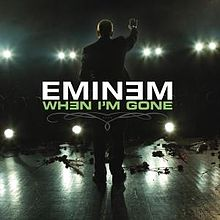

### WHEN I'M GONE

The single released by Eminem in the year 2005, was one of the best songs of that time. The song received most positive reviews from music critics.“When I’m Gone” was written in 2003 and released in 2005 by Shady Records, on the album Curtain Call: The Hits. It was thought at the time that this album would mark the beginning of an extended musical hiatus for Eminem, who had said:

>"I'm at a point in my life right now where I feel like I don't know where my career is going...This is the reason that we called it Curtain Call, because this could be the final thing. We don't know."

Since then he's also managed to release hits such as:
- I need a doctor (ft Dr Dre)
- I'm not afraid
- River (ft Ed Sheeran)

